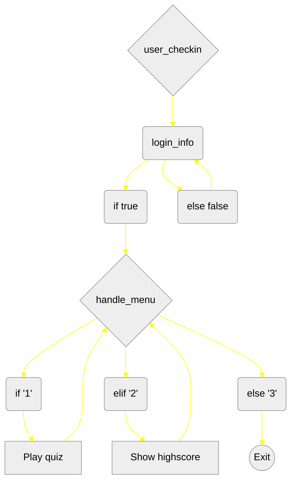

# PGR107 Python Assignment

```mermaid

%%{init: {'theme': 'neutral'}}%%
graph TD
idA{user_checkin} --> B(login_info)
linkStyle default stroke:yellow
B --> C(if true) --> D{handle_menu}
B --> E(else false) --> B(login_info)
D --> F(if '1') --> G[Play quiz]
D --> H(elif '2') --> I[Show highscore]
D --> J(else '3') --> K((Exit))
G --> D
I --> D
```